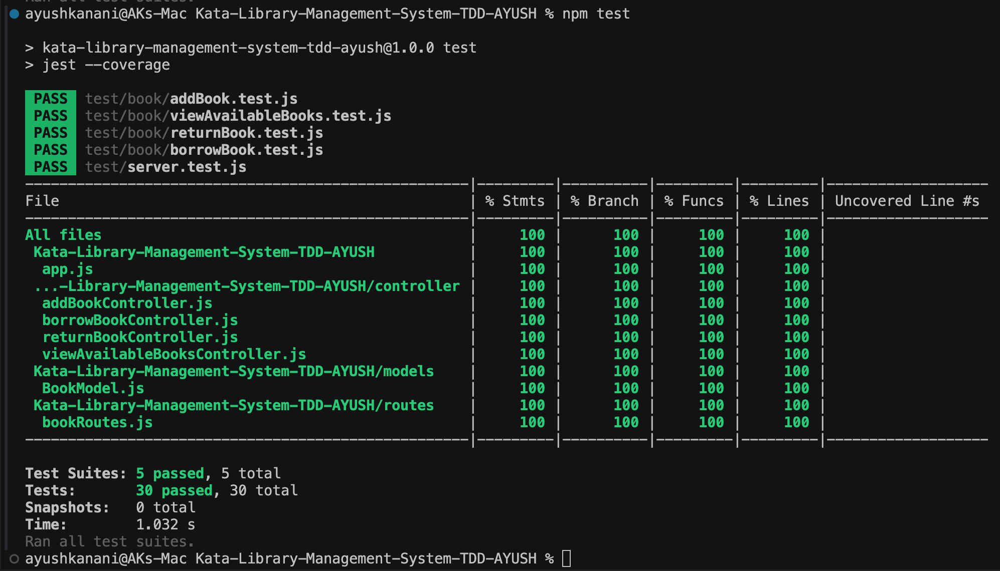
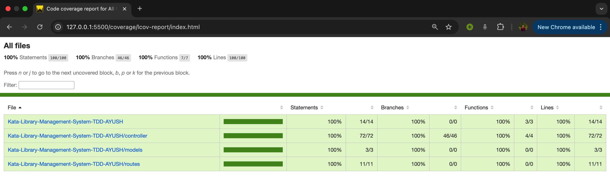

# Library Management TDD Kata Solution

Welcome to my solution for the Library Management Kata! This repository demonstrates the use of Test-Driven Development (TDD) to build a simple library management system. The project emphasizes small, incremental commits, clear and concise code, and thorough testing.

## Getting Started

To get started with the project, first, clone the repository and install the necessary dependencies:

### `git clone https://github.com/ayushkanani711/Kata-Library-Management-System-TDD.git`

Clone the repository to your local machine.

### `cd Kata Library Management System TDD AYUSH`

Navigate to the project directory.

### `npm install`

Install all the required dependencies.

# Available API Endpoints

In the project, you can interact with the following API endpoints:

### `POST http://localhost:5001/api/books/addNewBook`

Adds a new book to the library's inventory.

**Request Body:**

```json
{
  "title": "The Alchemist",
  "ISBN": "1234567890123",
  "author": "Paulo Coelho",
  "availableCopies": 5,
  "available": true,
  "yearOfPublish": 1988
}
```

**Response:**

```json
{
  "success": true,
  "message": "Book added successfully",
  "newBook": {
    "ISBN": "1234567890123",
    "title": "The Alchemist",
    "author": "Paulo Coelho",
    "yearOfPublish": 1988,
    "available": true,
    "availableCopies": 5,
    "_id": "676d9c2938bf9a3ffc748ef7",
    "__v": 0
  }
}
```

### `POST http://localhost:5001/api/books/borrowBook`

Borrows a book from the library.

**Request Body:**

```json
{
  "ISBN": "1234567890123"
}
```

**Response:**

```json
{
  "status": true,
  "message": "Book borrowed successfully",
  "updatedBook": {
    "_id": "676d9c2938bf9a3ffc748ef7",
    "ISBN": "1234567890123",
    "title": "The Alchemist",
    "author": "Paulo Coelho",
    "yearOfPublish": 1988,
    "available": true,
    "availableCopies": 4,
    "__v": 0
  }
}
```

### `POST http://localhost:5001/api/books/returnBook`

Returns a borrowed book to the library.

**Request Body:**

```json
{
  "ISBN": "1234567890123"
}
```

**Response:**

```json
{
  "status": true,
  "message": "Book returned successfully",
  "updatedBook": {
    "_id": "676d9c2938bf9a3ffc748ef7",
    "ISBN": "1234567890123",
    "title": "The Alchemist",
    "author": "Paulo Coelho",
    "yearOfPublish": 1988,
    "available": true,
    "availableCopies": 5,
    "__v": 0
  }
}
```

### `GET http://localhost:5001/api/books/viewAvailableBooks`

Retrieves a list of all books in the library.

**Response:**

```json
{
  "status": true,
  "message": "Books available",
  "availableBooks": [
    {
      "_id": "676d9c2938bf9a3ffc748ef7",
      "ISBN": "1234567890123",
      "title": "The Alchemist",
      "author": "Paulo Coelho",
      "yearOfPublish": 1988,
      "available": true,
      "availableCopies": 5,
      "__v": 0
    }
  ]
}
```

# Test Results

## Test Cases Passed:



## Coverage Report

To view the detailed coverage report, follow these steps:

1. **Run Coverage Report**:

   - Ensure you have run your tests with coverage enabled.
   - Locate the coverage report file at `http://127.0.0.1:5500/coverage/lcov-report/index.html`.

2. **Open the Report**:
   - Open the `index.html` file in a web browser to view the full coverage report.


